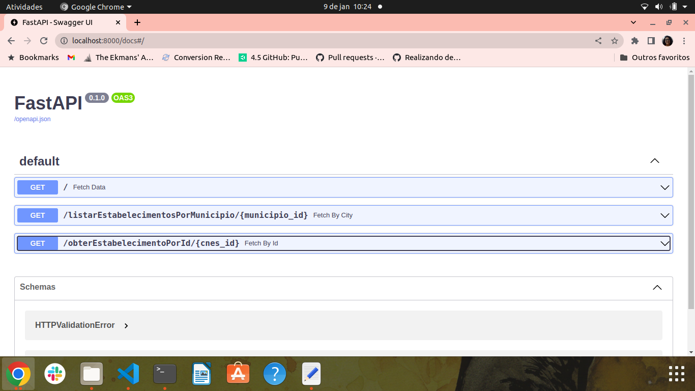

# Boas-vindas ao repositório BackEnd do desafio!

Essa API foi desenvolvida para o desafio técnico da ImpulsoGov.
Como uma organização que trabalha com saúde pública, com frequência se desenvolve plataformas que precisam consultar dados básicos da rede de atendimento do Sistema Único de Saúde brasileiro.

Neste desafio, foi implementado um webservice semelhante ao que usuaríamos em uma plataforma da organização, para retornar dados dos estabelecimentos de saúde vinculados ao SUS, tais como nome e localização (latitude e longitude).

Para isso, se consulta a tabela estabelecimentos que se encontra armazenada no arquivo dados.db. Esse arquivo é um banco de dados SQLite.

# Orientações

1. Clone o repositório

  - Use o comando: `git clone git@github.com:catherineteles/desafio_impulso_gov.git`
  - Entre na pasta do repositório que você acabou de clonar:
    - `desafio_impulso_gov`
  - Entre na pasta de backend:
    - `backend`

  2. Crie o ambiente virtual

  - `python3 -m venv .venv && source .venv/bin/activate`

  3. Instale as dependências

  - `python3 -m pip install -r requirements.txt`

  - `pip install databases[aiosqlite]`

  4. Inicie a API

  - `uvicorn main:app --reload`

  Você deve conseguir acompanhar pelo localhost:8000/

# Endpoints

Os endpoints disponíveis podem ser acessados pelo caminho localhost:8000/docs

1. getall '/'
2. getByCity '/listarEstabelecimentosPorMunicipio/{municipio_id}'
3. getById '/obterEstabelecimentoPorId/{cnes_id}'

